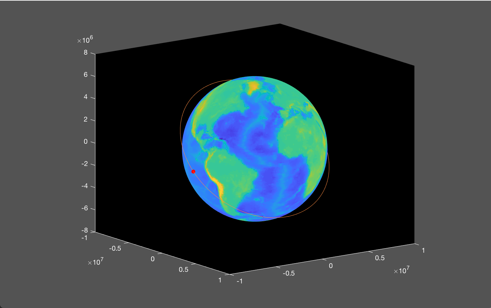
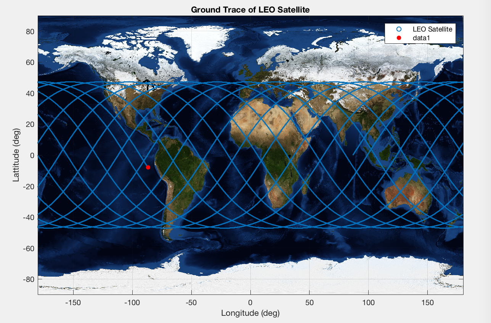

# Orbit Simulator
## Description
The purpose of the orbit simulator is to simulator a satellite orbit above the earth. The input of the orbit simulator is TLE data for any satellite. TLE stands for `two line element` that details the orbital elements of a satellite at a given time. The output is two graphs, one for displaying the 3D plot of the satellite orbit and the other for displaying the groundtrace.

## File Structure
`orbit_simulate` is the main file to be run. `functions/` contains all relevant functions to calculate the orbit trajectory. `module_conversion/` is a directory of all coordinate transformation functions. `TLE_Data/` contains satellite specific tle data.

## Running the simulator
1. Add TLE Data file to `TLE_Data/`
2. Edit the initialise segment of `orbit_simulate` to include the new TLE Data filename.
3. Change simulation duration if needed, it's defaulted to 86400s (1 day)
4. Run `orbit_simulate`

## TLE Data
TLE Data for most satellites can be obtained from https://www.celestrak.com/NORAD/elements/

## Plots

